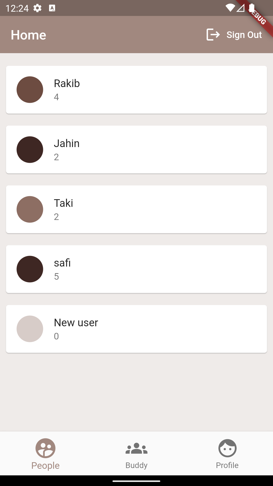
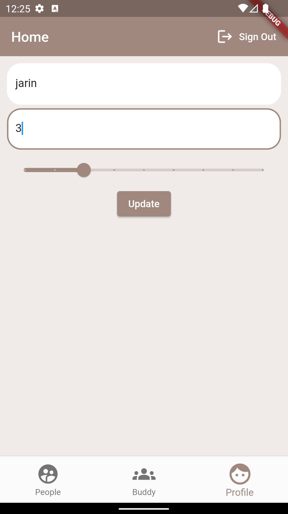
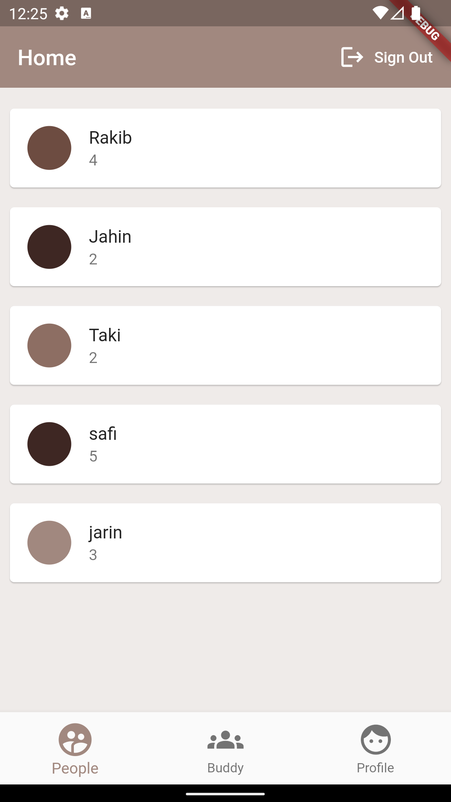
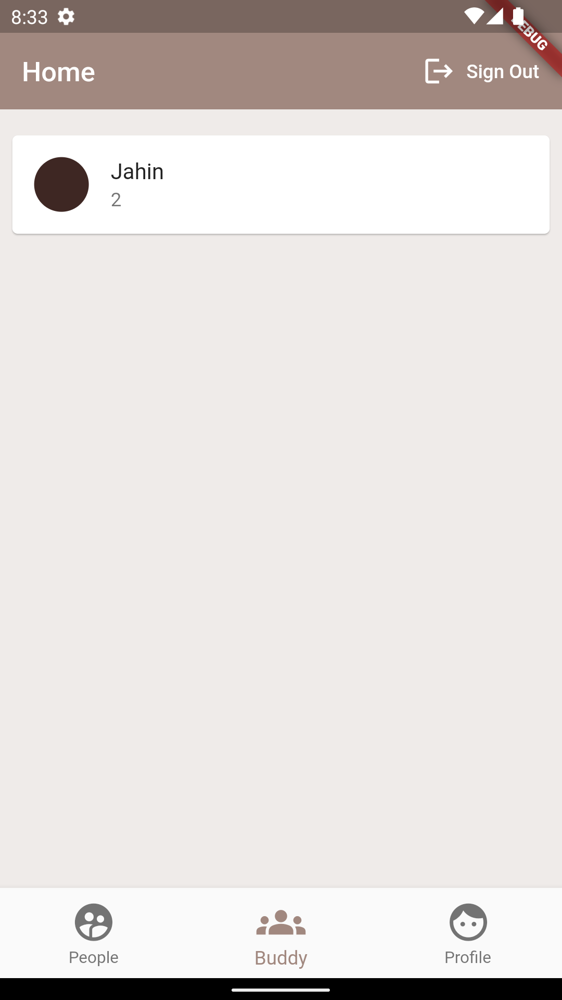

# coffeeBuddy
This is a personal flutter project for learning purpose.

## Components Used

* Android Studio
* Firebase (FireFluter)
  - Firebase Authentication
  - Cloud Firestore
* Flutter
* Dart
* [Flutter Spinkit](https://pub.dev/packages/flutter_spinkit)

## Features

* [Sign In](#sign-in)
* [Sign Up](#sign-up)
* [Home](#home)
  - [People](#people)
  - [Profile](#profile)
  - [Buddy](#buddy)
* [Loading Screen](#loading-screen)
* [Sign Out](#sign-out)

## TODO Features

* Chat

## Features details with screenshots

### Sign In

### Sign Up

Sign up have all sign in features such as validation etc.

### Home

#### People

#### Profile

#### Buddy

#### Loading Screen

#### Sign Out

User can sign out.

